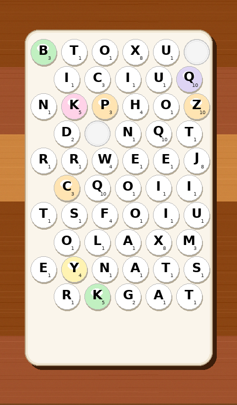

# BoardSnap — Word vs Word Solver

> Upload a screenshot of the **Word vs Word (Wix Games)** board and instantly get the highest-scoring & longest words playable on that hex board, with swipe paths drawn right on your image.



## Features — Spec Compliance

- **Board format** — vertical rounded-rect tray on wood, glossy circular bubble tiles in hex-packed staggered grid (5/6 alternating, ~10 rows), empty/popped holes (blank circles), tinted high-value tiles (tint ignored for scoring).
- **Tilt handling** — never assumes perfect grid; all positions derived from detection, row clustering tolerates 1–3° rotation.
- **Detection pipeline (Python + OpenCV + NumPy)** — dark-pixel threshold (`gray < 95`), connected components + centroid merging for I/J dots, HoughCircles + contour blob for bubble circles, cross-check, empty-hole detection (circles with no glyph), row snap by `y` clustering, `x`-sort.
- **Letter OCR** — template matching against `DejaVu Sans Bold` glyphs (upscaled 3–4×, Otsu threshold) with confidence; low-confidence tiles highlighted orange for manual correction before solving. EasyOCR/Tesseract hook available as fallback (see `detector.py`).
- **Values** — standard Scrabble values (no subscript OCR): `A1 B3 C3 D2 E1 F4 G2 H4 I1 J8 K5 L1 M3 N1 O1 P3 Q10 R1 S1 T1 U1 V4 W4 X8 Y4 Z10`.
- **Adjacency** — hex neighbors only: threshold `1.05 × median nearest-neighbor distance` (≈73 px horizontal, 55–60 px vertical on 470 px screenshots — auto-derived, never hard-coded).
- **Word search** — SOWPODS 267,751 words bundled as `backend/sowpods.txt` (no runtime fetch). Trie + DFS pruning, `max_len=15`, no tile reuse within a word, best-scoring path per word (sum of tile values). Solves 54-tile boards in <3 s (pure Python).
- **Results** — Top-10 by score, Top-10 by length, #1 highlighted, per-word annotated images (colored polyline + ring + numbered badges + legend), downloadable PNGs, mini previews, “trap tiles” (8/10-pt tiles in zero words), searchable “All words”, **Common words only** toggle (10 k Google-words subset in `common_words.txt`).
- **UI/UX** — single-page app: drag-&-drop → processing spinner → editable tile grid → results hero + tabs + searchable list. Mobile-friendly. Demo mode with 3 sample boards (`/api/example`).

## Tech Stack

- **Backend:** `Python 3.13 + FastAPI` (`/api/detect`, `/api/solve`, `/api/solve-tiles`, `/api/example/*`), `OpenCV + NumPy` detection, `Pillow` annotation, trie solver (`backend/solver.py`).
- **Frontend:** Plain `HTML/JS/CSS` (no build) — `fetch` to API, works when API also serves static frontend (same origin).
- **Hosting-ready:** API on Render/Railway, frontend on Vercel/Netlify — or single `uvicorn` serving both.

## Repo Layout

```
.
├── backend/
│   ├── main.py              # FastAPI app + CORS + static mount
│   ├── solver.py            # Trie, DFS, adjacency, ranking (unit-tested)
│   ├── detector.py          # OpenCV detection + template OCR
│   ├── annotator.py         # Path drawing → base64 PNG
│   ├── generate_samples.py  # Synthetic board generator (demo mode)
│   ├── sowpods.txt          # 267,751 words (bundled)
│   ├── common_words.txt     # 9,973 common words (google-10k)
│   ├── samples/             # 3 sample PNGs + JSON meta
│   └── requirements.txt
├── frontend/
│   ├── index.html
│   ├── app.js
│   └── styles.css
├── tests/
│   └── test_solver.py       # Solver unit tests (no detection dependency)
└── README.md
```

## Quick Start

### 1. Backend
```bash
cd backend
python -m venv .venv && source .venv/bin/activate
pip install -r requirements.txt
# sample boards already generated; regenerate if needed:
python generate_samples.py
uvicorn main:app --reload --host 0.0.0.0 --port 8000
# -> http://localhost:8000  (API + frontend)
# -> http://localhost:8000/docs  (Swagger)
```

### 2. Frontend (if served separately)
```bash
# Option A: API serves frontend at / (recommended) — no extra step.

# Option B: Separate static host
npx serve frontend
# Set API base in frontend/app.js const API = 'https://your-api.onrender.com';
```

### 3. Run Tests
```bash
python -m pytest tests/test_solver.py -v
# or
python tests/test_solver.py
```

## API

| Method | Path | Body | Returns |
|--------|------|------|---------|
| `GET` | `/api/health` | — | `{status, words, common}` |
| `GET` | `/api/examples` | — | `{examples:[{id,image_url,solve_url,target_word,…}]}` |
| `GET` | `/api/example/{id}/image` | — | PNG |
| `GET` | `/api/example/{id}/solve?common_only=false` | — | full solve JSON (tiles + results + hero_image base64) |
| `POST` | `/api/detect` | `multipart file` | `{tiles, detected_count, playable_count, empty_count}` |
| `POST` | `/api/solve` | `multipart file (+ common_only)` | same as `/api/example/{id}/solve` |
| `POST` | `/api/solve-tiles` | `JSON {tiles:[{x,y,letter,value,is_empty}], image_base64?, common_only}` or `multipart (file + tiles_json)` | same solve JSON + `traps` |

**Graceful errors:** `<10` tiles → `422 {error, detected, tiles}`.

**Annotated images:** `hero_image` + per-word `preview` are `data:image/png;base64,…` — save directly or set as ``.

## Solver Module (stand-alone)

```python
from solver import build_adjacency, solve_board, rank_results, find_trap_tiles
from solver import tiles_from_simple_grid  # test helper

tiles = [
  {"x":100,"y":100,"letter":"Q","value":10,"is_empty":False},
  {"x":170,"y":100,"letter":"A","value":1,"is_empty":False},
  # …
]
adj = build_adjacency(tiles)  # auto-threshold 1.05× median
results = solve_board(tiles, adjacency=adj)  # -> [{word,score,length,path}]
ranked = rank_results(results)
traps = find_trap_tiles(tiles, results)
```

- **No detection import needed** — pass any `{x,y,letter}` list.
- Handles repeated letters (tile-sequences, not letter-sequences), hex-only adjacency, max length 15, DFS pruning.
- **Performance:** ~50 tiles, branching ≤6, depth 15 → typically 200–800 ms in CPython (trie pruning).

## Detection Notes

- **Implement exactly spec pipeline** — see `detector.py:detect_board()`.
- **OCR fallback:** template matching primary (robust to offline); if `pytesseract` + `tesseract` binary present, tries `--psm 10 -c tessedit_char_whitelist=A-Z` before template.
- **Manual fix UI:** after `/api/detect`, frontend shows editable grid; flagged low-confidence (`<0.6`) tiles get orange ring. User corrections sent to `/api/solve-tiles` — makes the app robust despite OCR limits.

## Demo Mode

`backend/samples/sample_{1,2,3}.png` are generated synthetically to match real board optics (wood, rounded rect, glossy bubbles, subscript values, tints, 1–3 holes, slight rotate).  
- `python backend/generate_samples.py` regenerates them.
- API: `GET /api/example/1/solve` → instant results (no upload).
- Frontend: “Try a demo board” cards at top.

## Deployment

**Single service (easiest):**
- Build: `pip install -r backend/requirements.txt`
- Start: `uvicorn backend.main:app --host 0.0.0.0 --port $PORT`
- `main.py` mounts `../frontend` at `/`, so `/*` serves the UI and `/api/*` the API.

**Split:**
- API → Render/Railway: root `backend`, start command above, health check `/api/health`.
- Frontend → Vercel/Netlify: root `frontend`, rewrite `/api/*` to API origin or set `const API='https://api.example.com'` in `app.js`.

## Accuracy Edge Cases Covered

- Tilt tolerance via `y`-clustering, not grid math.
- 0–4 holes anywhere including row edges.
- Hex adjacency threshold prevents distance-2 false neighbors.
- 26–55 tiles, 2-letter words valid.
- Same letter on multiple tiles → distinct paths.
- <10 tiles → graceful error (bad screenshot).

## License

MIT — dictionary files are word lists (facts) bundled for offline use.

---

## Update 2026-10-02 — Blank Bubbles as Wildcards (★)

**Observed game behavior:** On `wizgames.com` the old solver skipped blank bubbles. In the actual game, blanks are **wildcards**: when you swipe through a blank, the backend *randomly assigns any letter A-Z* (0 pts, like Scrabble blank).  

BoardSnap now **correctly tries A-Z for each blank**:

- Detection marks blanks as `is_wildcard` (gold ★, 0 pts) — not holes. Toggle `★ Use blanks as wildcards` is **ON by default** (like the real game).  
- Solver `DFS` branches over all 26 letters for each wildcard, pruning via trie. With 0–4 blanks this is still <1s.  
  ```python
  # wildcard tile can be any child of current trie node
  for ch, child in node.children.items():
      dfs(..., current_word + ch, score + 0, wildcard_map={tile: ch})
  ```
  Score for blanks is **0** (Scrabble blank). Change `values[nb]` to `SCRABBLE_VALUES[ch]` if you want blanks to score as the assigned letter.
- Annotated images highlight wildcard tiles with **gold rings + dashed white hint** and legend `★ blank`. Word displays underline wildcard letters with ★.
- Toggle **OFF** to treat blanks as holes (skip) — reproduces the old wizgames site behavior.  
  - API: `POST /api/solve` / `GET /api/example/1/solve?use_wildcards=false` / `POST /api/solve-tiles {use_wildcards: true}`  
  - UI: `★ Wildcards` checkbox in hero, detect, and results — syncs across.

**Verification:**
- `sample_1` (4 blanks): `561` words with wildcards vs `175` without. Top still `QUIXOTIC 26` (no blank needed), but many new words like `QUICKEN (blank=E)` appear. Blanks shown gold in image, ★ in word.
- Solver unit tests still pass (holes remain holes when `is_wildcard=False`).

